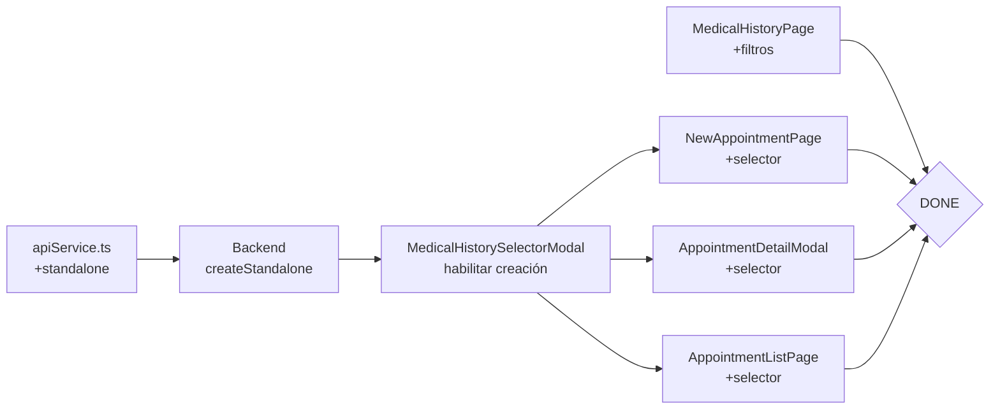

# Especificación: Integración de copiaModificados

> Basado en el análisis de `copiaModificados/src/` (22 archivos) vs `src/` actual.

---

## 1. MedicalHistorySelectorModal — Habilitar creación de historiales

### Contexto

El modal `MedicalHistorySelectorModal` permite al usuario seleccionar un historial
médico existente para asociarlo a una cita, o crear uno nuevo desde cero.

En `src` actual, la funcionalidad de **crear** está deshabilitada con un mensaje
de limitación del MVP.

### Requerimientos

1. **DEBE** permitir crear un nuevo historial médico sin necesidad de una cita existente.
2. **DEBE** aceptar: nombre del historial, pacienteId, pacienteNombre, pacienteEspecie, createdBy.
3. **PUEDE** crear el historial vacío (sin citas asociadas).

### Cambios necesarios

#### Frontend

| Archivo | Cambio |
|---------|--------|
| `src/features/medical/MedicalHistorySelectorModal.tsx` | Reemplazar `handleConfirmCreate` para que llame a `medicalRecordApi.createStandalone(...)` |
| | Agregar `pacienteEspecie` a las props y al estado |
| | Agregar botón "Crear Historial" en modo selección (copia tiene `<FaPlus /> Crear Historial`) |

#### API Service

| Archivo | Cambio |
|---------|--------|
| `src/data/services/apiService.ts` | Agregar método `medicalRecordApi.createStandalone(data)` que haga `POST /medical-records/standalone` |

#### Backend

| Archivo | Cambio |
|---------|--------|
| `backend/src/routes/medicalRecords.js` | Agregar ruta `POST /standalone` |
| `backend/src/controllers/medicalRecordController.js` | Agregar método `createStandalone` que llame a nuevo SP o inserte directamente |
| `db/schema.sql` | Agregar SP `sp_create_medical_record` si no existe |

### Escenarios

```
Scenario 1: Crear historial desde selector
  Given el usuario abre MedicalHistorySelectorModal desde AppointmentListPage
  When hace clic en "Crear Historial"
    And ingresa "Historial de Luna - 2026"
    And confirma
  Then se crea un nuevo MedicalRecord vacío
    And se selecciona automáticamente en el modal

Scenario 2: Error sin nombre
  Given el usuario está en modo creación
  When hace clic en "Crear Historial" sin ingresar nombre
  Then se muestra error "Debe ingresar un nombre"

Scenario 3: Error sin pacienteId
  Given el modal se abrió sin pacienteId
  When intenta crear historial
  Then se muestra error "No se pudo identificar el paciente"
```

---

## 2. Integrar MedicalHistorySelectorModal en AppointmentListPage

### Contexto

Al hacer clic en "Historial" en la tabla de citas, actualmente se abre un modal
que guarda directo a historial sin permitir seleccionar qué historial usar.

### Requerimientos

1. **DEBE** abrir MedicalHistorySelectorModal al hacer clic en "Historial".
2. **DEBE** permitir seleccionar un historial existente o crear uno nuevo.
3. **DEBE** mostrar el modal de notas del historial con el historial seleccionado.
4. **DEBE** mostrar el badge del historial seleccionado con botón "Cambiar".

### Cambios necesarios

| Archivo | Cambio |
|---------|--------|
| `src/features/appointments/AppointmentListPage.tsx` | Agregar estado `selectedRecord: MedicalRecord \| null` |
| | Agregar estado `showSelector: boolean` |
| | Envolver el modal "Guardar en Historial Médico" con lógica de selector similar a copiaModificados |
| | Agregar badge de historial seleccionado + botón Cambiar |
| | Pasar `onConfirm` al selector para setear `selectedRecord` |
| | En `handleSaveToHistory`, pasar `selectedRecord.id` a la API |

### Escenarios

```
Scenario: Guardar cita en historial específico
  Given hay citas registradas
  When usuario hace clic en "Historial" de una cita activa
    And selecciona un historial médico existente
    And confirma
  Then se muestra el modal de guardado con el historial seleccionado
    And el badge muestra "Historial: {nombre}"
    And al guardar, la cita se asocia a ese historial
```

---

## 3. Integrar MedicalHistorySelectorModal en AppointmentDetailModal

### Contexto

El modal de detalle de cita tiene una sección "Historial Médico" que actualmente
guarda directo sin permitir seleccionar historial.

### Requerimientos

1. **DEBE** tener el mismo flujo de selección que AppointmentListPage.
2. **DEBE** mostrar badge del historial seleccionado con botón "Cambiar".
3. **DEBE** persistir la selección entre renders del modal.

### Cambios necesarios

| Archivo | Cambio |
|---------|--------|
| `src/features/appointments/AppointmentDetailModal.tsx` | Agregar `showSelector`, `selectedRecord` al estado |
| | Agregar `<MedicalHistorySelectorModal>` integration |
| | Reemplazar botón directo "Guardar en Historial Médico" por badge + selector |
| | En `handleSaveToHistory`, pasar `selectedRecord.id` |

### Escenarios

```
Scenario: Guardar a historial desde detalle de cita
  Given usuario abre detalle de una cita
  When va a la sección Historial Médico
    And hace clic en "Guardar en Historial Médico"
  Then se abre MedicalHistorySelectorModal
  When selecciona un historial
    And escribe notas clínicas
    And confirma
  Then se guarda la cita en el historial seleccionado
    And se muestra mensaje de éxito
```

---

## 4. Integrar MedicalHistorySelectorModal en NewAppointmentPage

### Contexto

Al crear una cita nueva con "Guardar en Historial Médico" activado, actualmente
se envía `guardarHistorial: true` al backend sin seleccionar un historial específico.

### Requerimientos

1. **DEBE** abrir MedicalHistorySelectorModal al activar el toggle de historial.
2. **DEBE** mostrar badge del historial seleccionado con botón "Cambiar".
3. **DEBE** pasar `medicalRecordId` al crear la cita si se seleccionó un historial.

### Cambios necesarios

| Archivo | Cambio |
|---------|--------|
| `src/features/appointments/NewAppointmentPage.tsx` | Agregar `showSelector`, `selectedRecord` al estado |
| | Agregar `<MedicalHistorySelectorModal>` integration |
| | El toggle activa el selector en lugar de solo mostrar textarea |
| | En `handleSubmit`, pasar `medicalRecordId: selectedRecord?.id` |
| | Agregar import de `FaFolderOpen` y `MedicalHistorySelectorModal` |

### Escenarios

```
Scenario: Crear cita con historial específico
  Given usuario está en paso 2 de Nueva Cita
  When activa "Guardar en Historial Médico"
  Then se abre MedicalHistorySelectorModal
  When selecciona un historial existente
    And completa los datos de la cita
    And registra la cita
  Then la cita se crea con el paciente
    And la cita se asocia al historial seleccionado
```

---

## 5. MedicalHistoryPage — Agregar filtros avanzados

### Contexto

La página de Historial Médico tiene búsqueda básica pero no filtros avanzados
como los que tiene AppointmentListPage (filtrar por animal, dueño, especie,
procedimiento, hora, fecha). copiaModificados sí los tiene.

### Requerimientos

1. **DEBE** tener los mismos filtros avanzados que AppointmentListPage.
2. **DEBE** tener toggle mostrar/ocultar.
3. **DEBE** tener botón "Limpiar filtros" que resetee todos.

### Cambios necesarios

| Archivo | Cambio |
|---------|--------|
| `src/features/medical/MedicalHistoryPage.tsx` | Agregar estados: `showAdvancedFilters`, `filterAnimal`, `filterDueno`, `filterEspecie`, `filterProcedimiento`, `filterHora`, `filterFecha` |
| | Agregar botón toggle de filtros avanzados (`FaFilter`) |
| | Agregar UI de filtros (mismo patrón que AppointmentListPage) |
| | Integrar filtros en la lógica de `filteredRecords` |
| | Agregar función `clearAdvancedFilters` |
| | Agregar import de `FaFilter` y `FaTimes` |

### Escenarios

```
Scenario: Filtrar historiales
  Given hay múltiples historiales médicos
  When usuario activa "Filtros avanzados"
    And ingresa "Canino" en especie
    And selecciona una fecha
  Then solo se muestran los historiales de pacientes caninos con citas en esa fecha
```

---

## 6. MedicalHistorySelectorModal — Agregar botón "Crear" en modo selección

### Contexto

copiaModificados tiene un botón "Crear Historial" (`<FaPlus />`) en el modo
selección del modal, que permite crear un historial sin salir del modal.
El `src` actual no lo tiene.

### Requerimientos

1. **DEBE** tener botón "Crear Historial" en la fila de búsqueda del modal.
2. **DEBE** alternar al modo creación al hacer clic.
3. **DEBE** refrescar la lista de historiales después de crear uno nuevo.

### Cambios necesarios

| Archivo | Cambio |
|---------|--------|
| `src/features/medical/MedicalHistorySelectorModal.tsx` | Agregar función `handleCreateNew` |
| | Agregar botón `<FaPlus /> Crear Historial` en `.searchRow` |
| | Después de crear, refrescar `records` con `medicalRecordApi.getAll()` |

---

## Resumen de cambios por archivo

### Frontend — Archivos a modificar

| # | Archivo | Tipo de cambio | Líneas estimadas |
|---|---------|----------------|------------------|
| 1 | `src/features/medical/MedicalHistorySelectorModal.tsx` | Habilitar creación + botón Crear | +40 |
| 2 | `src/features/appointments/AppointmentListPage.tsx` | Integrar MedicalHistorySelectorModal | +80 |
| 3 | `src/features/appointments/AppointmentDetailModal.tsx` | Integrar MedicalHistorySelectorModal | +60 |
| 4 | `src/features/appointments/NewAppointmentPage.tsx` | Integrar MedicalHistorySelectorModal | +70 |
| 5 | `src/features/medical/MedicalHistoryPage.tsx` | Agregar filtros avanzados | +80 |
| 6 | `src/data/services/apiService.ts` | Agregar método standalone | +10 |

### Backend — Archivos a modificar

| # | Archivo | Cambio |
|---|---------|--------|
| 7 | `backend/src/controllers/medicalRecordController.js` | Agregar `createStandalone` |
| 8 | `backend/src/routes/medicalRecords.js` | Agregar ruta |

### Base de datos — Opcional

| # | Archivo | Cambio |
|---|---------|--------|
| 9 | `db/schema.sql` | Crear SP si no existe |

### Archivos que NO requieren cambios

- `src/App.tsx` ✅
- `src/layouts/AppLayout/Sidebar.tsx` ✅
- `src/features/dashboard/DashboardPage.tsx` ✅
- `src/features/auth/LoginPage.tsx` ✅
- `src/features/auth/LoginPage.module.css` ✅
- `src/features/procedures/ProcedureListPage.tsx` ✅
- `src/features/procedures/ProcedureEditModal.tsx` ✅
- `src/features/appointments/DayAppointmentsPage.tsx` ✅
- `src/features/appointments/*.module.css` (ya existen y se copiaron) ✅
- `src/features/medical/*.module.css` (ya existen) ✅
- `src/context/AuthContext.tsx` ✅
- `src/shared/types/index.ts` ✅ (ya en sync)
- `src/data/mock/mockService.ts` ✅ (solo referencia, no se usa)
- `src/data/services/types.ts` ✅ (solo referencia, no se usa)
- `copiaModificados/src/data/mock/data.ts` ✅ (solo seed data mock, no se copia)

## Orden de implementación sugerido



1. **apiService.ts** — Agregar método `createStandalone`
2. **Backend** — Controlador + ruta para `POST /medical-records/standalone`
3. **MedicalHistorySelectorModal** — Habilitar creación, agregar botón Crear
4. **AppointmentListPage** — Integrar selector
5. **AppointmentDetailModal** — Integrar selector
6. **NewAppointmentPage** — Integrar selector
7. **MedicalHistoryPage** — Agregar filtros avanzados

## Patrón de conversión mock → API

Para referencia al implementar:

```ts
// MOCK (síncrono, en copiaModificados):
const data = mockService.getXxx();
const item = mockService.getById(id);
const created = mockService.createXxx(data);

// API (async, en src actual):
const [data, setData] = useState<Type[]>([]);
useEffect(() => {
  apiService.getAll().then(setData).catch(handleError);
}, []);

const handleCreate = async () => {
  const created = await apiService.create(data);
  // refresh list
};

// Lookup helpers (mock síncrono):
const getName = (id) => mockService.getById(id)?.nombre || '—';

// Lookup helpers (API asíncrono - usar lookup maps):
const [map, setMap] = useState<Record<string, Type>>({});
useEffect(() => {
  apiService.getAll().then(items => {
    setMap(Object.fromEntries(items.map(i => [i.id, i])));
  });
}, []);
const getName = (id) => map[id]?.nombre || '—';
```

## Criterios de aceptación

- [ ] MedicalHistorySelectorModal permite crear historiales nuevos (no solo seleccionar)
- [ ] AppointmentListPage: clic en "Historial" abre selector antes del modal de guardado
- [ ] AppointmentDetailModal: sección historial tiene selector antes de guardar
- [ ] NewAppointmentPage: toggle de historial abre selector
- [ ] MedicalHistoryPage: filtros avanzados funcionales
- [ ] `npm run build` sin errores de TypeScript
- [ ] Backend responde `POST /medical-records/standalone` correctamente
- [ ] Los datos mock de copiaModificados NO se copian a src/ (solo la UI/UX adaptada)
